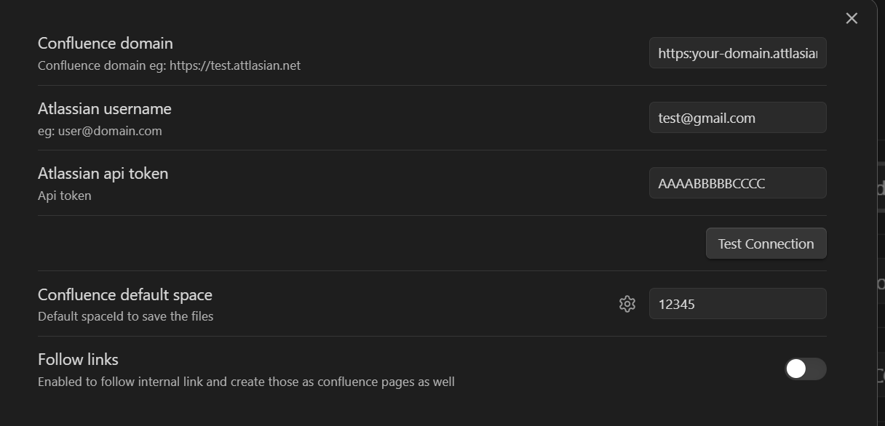
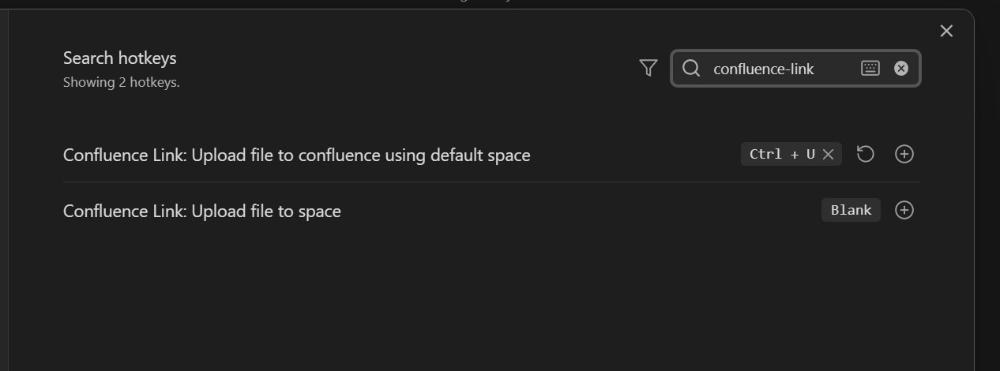
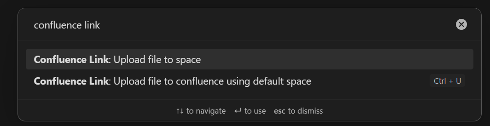

## Confluence Link

Welcome to the `Confluence Link` project. The objective of this project is to make it easy to write documentation on Obsidian and quicky create a Confluence page to share with you team members.

## Setting things up

1. Open the plugin settings and configure the following fields:

-   `Confluence Domain`: The URL of your Atlassian Confluence instance
-   `Atlassian User Name`: Your Atlassian account's email address
-   `Atlassian API Token`: Your Atlassian API token. You can generate one from your [Atlassian Account Settings](https://id.atlassian.com/manage-profile/security/api-tokens).
-   (Optional) `Confluence Default Space`: The space identifier where all you confluence pages will be created

2. (Optional) Open the default obsidian hotkeys settings:

-   search for `confluence-link`
-   add hotkeys

## Usage

1. Open a md file
2. Press the hotkey set at step 2 in [Settings things up](#Setting-things-up) section or use the command pallet (`Ctrl/Cmd + P` ) and search for `Obs2Con Flux` commands to execute

